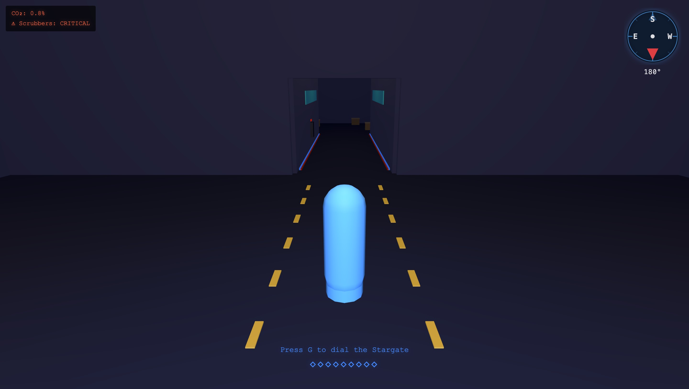
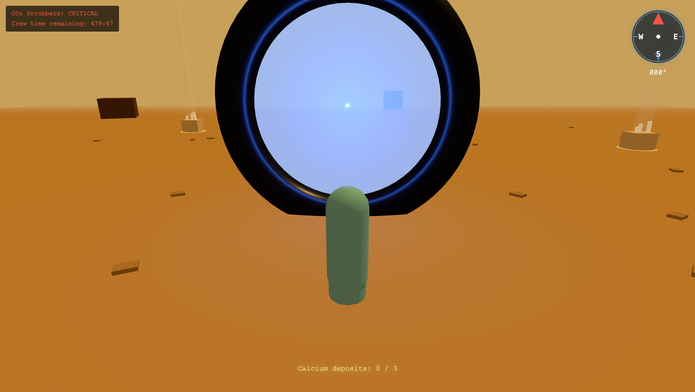
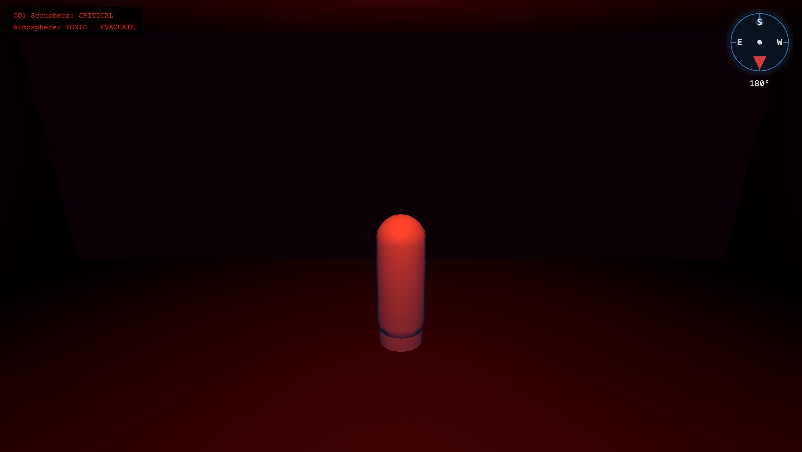

# Stargate Universe

A browser-based sci-fi open-world RPG set in the Stargate Universe TV series. Players crew the ancient ship *Destiny*, managing resources, exploring alien worlds, and making story-defining choices — rendered in real-time WebGPU in the browser.

Built on **Three.js r181 WebGPU** + Crashcat physics + the `@ggez/*` vibe-game-engine runtime.

## Scripts

```bash
bun install
bun run dev
bun run build
```

## What This Starter Includes

- plain Vite app
- modular game runtime shell
- scene registry in `src/scenes`
- animation bundle registry in `src/animations`
- scene-local runtime manifests and assets
- animation-local graph/artifact manifests, entry modules, and assets
- starter capsule controller driven by runtime camera/player settings
- static collision extraction from runtime physics definitions
- scene-level `systems`, `mount`, and `gotoScene(...)` hooks
- Rapier runtime initialization
- gameplay-runtime bootstrap

## First Steps

1. Run the app and move around in the included starter scene.
2. Replace `src/scenes/main/scene.runtime.json` with your exported runtime scene when ready.
3. If your scene has assets, place them under `src/scenes/main/assets/`.
4. Export animation bundles from the animation editor and unpack them into `src/animations/<animation-name>/`, keeping the generated `index.ts`.
5. Add custom scene logic in `src/scenes/main/index.ts` and custom animation wiring in your own gameplay code.
6. Add more scene folders under `src/scenes/<scene-id>/` when you need more than one runtime scene.

## Runtime Packages

- `@ggez/three-runtime`
- `@ggez/runtime-format`
- `@ggez/gameplay-runtime`
- `@ggez/runtime-physics-crashcat`
- `@ggez/anim-runtime`
- `@ggez/anim-three`
- `@ggez/anim-exporter`

## Notes

The scaffold is intentionally vanilla, but it is structured as a real game app rather than a preview playground.

Animation bundles are intentionally low-level. The starter exposes discovery, lazy loading, and preload helpers, but your game code still owns character loading, controller logic, parameter updates, and when to instantiate an animator.

Expected animation export layout:

```text
src/animations/player-locomotion/
	index.ts
	animation.bundle.json
	graph.animation.json
	assets/
		hero.glb
		jump-start.glb
		run-forward.glb
```

---

## Screenshots / Demo

### The Air Crisis Questline

The first major questline aboard *Destiny*: CO₂ scrubbers are failing, the atmosphere is
going toxic, and the only way to fix them is to gate to a desert planet and mine calcium
deposits for lime. Three scenes, one decision loop.

**Gate Room** — Quest begins here. Rush delivers the briefing. Press G to dial the gate.



**Desert Planet** — Sprint against the clock. Collect 3 calcium deposits before the timer expires and the gate closes.



**CO₂ Scrubber Room** — Emergency red. Flickering power. Interact with each scrubber unit to
repair it. Atmosphere is TOXIC — EVACUATE until all three are fixed.



---

Typical usage:

```ts
import { createAnimatorInstance } from "@ggez/anim-runtime";
import { animations } from "./animations";

const locomotionBundle = await animations["player-locomotion"].source.load();
await locomotionBundle.preloadAssets();
const character = await locomotionBundle.loadCharacterAsset();

if (!character) {
	throw new Error("Animation bundle is missing its exported character asset.");
}

const clips = await locomotionBundle.loadGraphClipAssets(character.skeleton);
const animator = createAnimatorInstance({
	rig: character.rig,
	graph: locomotionBundle.artifact.graph,
	clips
});

animator.setFloat("speed", 1);
animator.setBool("grounded", true);
```


## Next Steps
- [ ] Implement more robust error handling in the scene transition logic.
- [ ] Add JSDoc to all exported classes in `src/`.
- [ ] Optimize texture loading for the Gate Room scene.