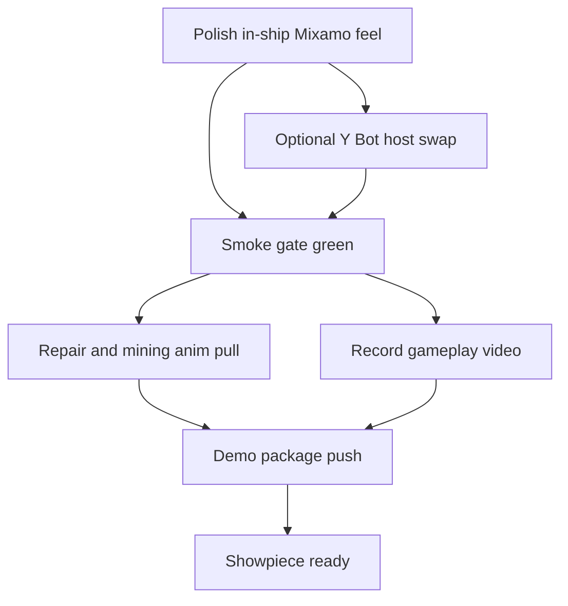
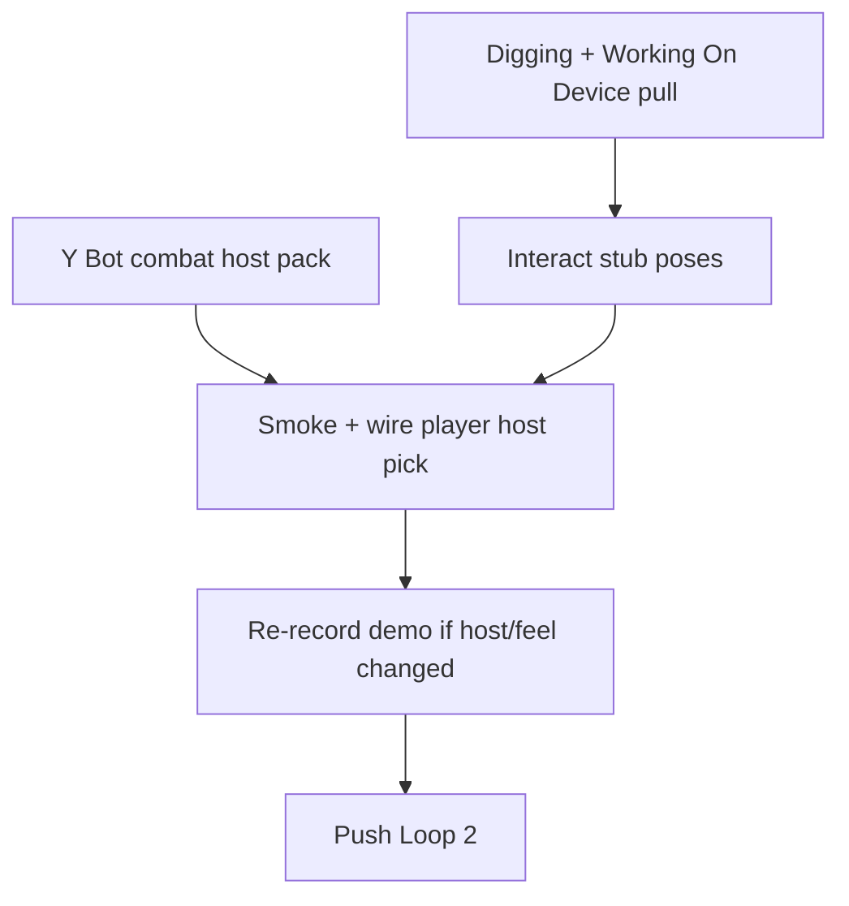

# Engineering Graph Loop — Mixamo Demo Showpiece

**Branch:** `feature/mint-character-proof-of-concept`  
**Goal:** Cool Destiny ship-scene demo with Mixamo combat + recorded gameplay video.

Directed graph runs in chat (Cursor Automations abandoned — not reliable for this loop).

## Loop 1 — Showpiece (DONE)

| Node | Status |
|------|--------|
| A In-ship polish | done |
| B Y Bot host | **deferred → Loop 2** |
| C Smoke gate | done |
| D Repair/mining anims | **done → Loop 2 D2** |
| E Gameplay video | done (`screenshots/result/mixamo_combat_demo.mp4`) |
| F Push | done (`bdec6ba`) |
| G Showpiece ready | done |

## Loop 2 — Host + interact depth (ACTIVE)

### Node B2 — Y Bot combat host
- Retarget Swat combat clip set onto `incoming/Y Bot.fbx` (same Mixamo skeleton)
- Rebuild: `blender -b -P tools/blender_mixamo_rifle_combat.py -- --host ybot` → `YBot_rifle_combat.glb` (gitignored)
- Keep `Swat_rifle_combat.glb` as fallback; `MixamoCombatAvatar.resolve_combat_glb()` prefers Y Bot when present
- Wire `MixamoCombatAvatar` / player export to pick host when Y Bot pack present — **done**

### Node D2 — Repair / mining assets
- [x] **done 2026-07-24** — Digging + Working On Device exported onto **Y Bot** (`4f5d21e1-4ccc-41f1-b35b-fb2547bd8493`) via authenticated Mixamo API (`animations/export` + `gms_hash` + `characters/:id/monitor` → S3)
- Local (gitignored): `models/mixamo_openbot/incoming/Digging.fbx`, `models/mixamo_openbot/incoming/Working On Device.fbx`
- IDs: Digging `c9c6cd3e-b96c-11e4-a802-0aaa78deedf9` · Working On Device `c9c6cf65-b96c-11e4-a802-0aaa78deedf9`
- **done** — `tools/blender_mixamo_rifle_combat.py` CLIPS includes `Digging` + `Working_On_Device`; rebuild Y Bot pack bakes them into `YBot_rifle_combat.glb` (gitignored)

### Node H — Interact stubs
- **done** — `MixamoCombatAvatar.begin_tool_use(kind)` / `end_tool_use()`; Digging/Working clips when present, else Idle + HUD “Working…”
- Player delegates via `begin_tool_use` / `end_tool_use`; salvage + repair console wire timed poses
- Demo movie beat: holster → tool-use → walk (`01b_tool_use`)

### Node I / J / K — Verify + show
- **done 2026-07-24 (cloud)** — `mixamo-player` 30/30, `e1-opening` PASS, `scene` 64, `mint-character` PASS (Rush Meshy soft-skip). Rebuilt via `tools/blender_mixamo_proxy_combat.py` (no Mixamo `incoming/`). Re-recorded `tools/record_mixamo_combat_demo.sh` (opengl3) → `screenshots/result/mixamo_combat_demo.mp4` (~14.0s) + `docs/demo/mixamo_combat_demo_*.jpg` / preview reel. Branch `cursor/mixamo-character-combat-scene-e52c`.
- Conventional commits; never Mixamo ToS / `models/mint/rush` / screenshot binaries

## Hard rules
- Mixamo-first; no analytic IK aim
- Exact clip contract in `docs/animation/mixamo-rifle-combat-showcase.md`
- Never commit Mixamo FBX/GLB under ToS gitignore

### Node J — Re-record demo (Y Bot / proxy)
- **done** 2026-07-24 — Prefer Y Bot pack when present; cloud agents use proxy `Swat_rifle_combat.glb` from `vrm/anim_src`.
- Output: `screenshots/result/mixamo_combat_demo.mp4` (~14.0s, gitignored). Beat frames under `screenshots/result/mixamo_combat_demo/` and evidence JPGs in `docs/demo/`.
- Record run: non-fatal `planet_gate.gd` overlapping-bodies warning at boot; demo movie completed all beats.
